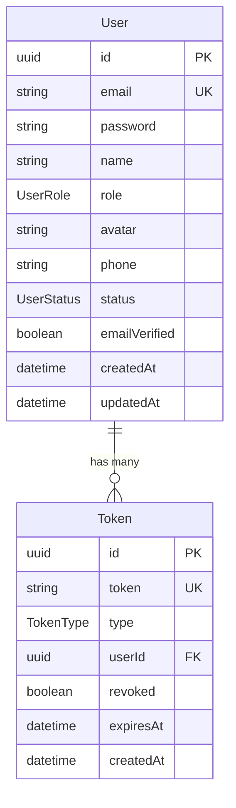

# Database Schema Documentation

Tài liệu mô tả chi tiết về cấu trúc database của LCT-NODEJS-CORE.

## Overview

Database sử dụng PostgreSQL với Prisma ORM. Schema được định nghĩa trong `prisma/schema.prisma`.

## Schema Structure

### Enums

#### UserRole

```prisma
enum UserRole {
  USER        // Người dùng thường
  ADMIN       // Quản trị viên
  MODERATOR   // Người điều hành
}
```

#### UserStatus

```prisma
enum UserStatus {
  ACTIVE      // Tài khoản hoạt động
  INACTIVE    // Tài khoản chưa kích hoạt
  SUSPENDED   // Tài khoản bị tạm khóa
}
```

#### TokenType

```prisma
enum TokenType {
  REFRESH               // Token làm mới JWT
  EMAIL_VERIFICATION    // Token xác thực email
  PASSWORD_RESET        // Token reset mật khẩu
}
```

## Models

### User Model

```prisma
model User {
  id            String      @id @default(uuid())
  email         String      @unique
  password      String
  name          String
  role          UserRole    @default(USER)
  avatar        String?
  phone         String?
  status        UserStatus  @default(ACTIVE)
  emailVerified Boolean     @default(false)
  createdAt     DateTime    @default(now())
  updatedAt     DateTime    @updatedAt

  tokens        Token[]

  @@index([email])
  @@index([role])
  @@index([status])
  @@map("users")
}
```

**Mô tả các trường:**

- `id`: UUID làm khóa chính
- `email`: Email duy nhất, có index để tìm kiếm nhanh
- `password`: Mật khẩu đã được hash (bcrypt)
- `name`: Họ tên đầy đủ
- `role`: Vai trò người dùng (mặc định USER)
- `avatar`: URL ảnh đại diện (nullable)
- `phone`: Số điện thoại (nullable)
- `status`: Trạng thái tài khoản (mặc định ACTIVE)
- `emailVerified`: Trạng thái xác thực email (mặc định false)
- `createdAt`: Thời gian tạo (tự động)
- `updatedAt`: Thời gian cập nhật (tự động)

**Relations:**

- `tokens`: One-to-many với Token model

**Indexes:**

- `email`: Unique index để tăng tốc đăng nhập
- `role`: Index để filter theo role
- `status`: Index để filter theo status

### Token Model

```prisma
model Token {
  id        String    @id @default(uuid())
  token     String    @unique
  type      TokenType
  userId    String
  revoked   Boolean   @default(false)
  expiresAt DateTime
  createdAt DateTime  @default(now())

  user      User      @relation(fields: [userId], references: [id], onDelete: Cascade)

  @@index([userId])
  @@index([token])
  @@map("tokens")
}
```

**Mô tả các trường:**

- `id`: UUID làm khóa chính
- `token`: Chuỗi token duy nhất
- `type`: Loại token (REFRESH, EMAIL_VERIFICATION, PASSWORD_RESET)
- `userId`: Foreign key đến User
- `revoked`: Trạng thái thu hồi token (mặc định false)
- `expiresAt`: Thời gian hết hạn
- `createdAt`: Thời gian tạo (tự động)

**Relations:**

- `user`: Many-to-one với User model
- Cascade delete: Xóa user sẽ xóa tất cả tokens

**Indexes:**

- `userId`: Index để tìm tokens của user
- `token`: Index để verify token nhanh

## Database Relationships



## Seeding Data

### Default Users

Khi chạy `npm run prisma:seed`, hệ thống tạo 2 user mặc định:

```javascript
// Admin User
{
  email: 'admin@lct.com',
  password: '123456', // hashed
  name: 'Admin User',
  role: 'ADMIN',
  status: 'ACTIVE',
  emailVerified: true
}

// Test User
{
  email: 'user@lct.com',
  password: '123456', // hashed
  name: 'Test User',
  role: 'USER',
  status: 'ACTIVE',
  emailVerified: true
}
```

## Schema Evolution

### Migration Strategy

1. **Development**: Sử dụng `prisma db push`

   ```bash
   npx prisma db push
   ```

2. **Production**: Sử dụng migrations

   ```bash
   # Tạo migration
   npx prisma migrate dev --name add_new_field

   # Deploy lên production
   npx prisma migrate deploy
   ```

### Common Schema Changes

#### Thêm trường mới

```prisma
model User {
  // ... existing fields
  biography String? // Thêm trường biography (nullable)
}
```

#### Thêm enum value

```prisma
enum UserRole {
  USER
  ADMIN
  MODERATOR
  SUPER_ADMIN // Thêm role mới
}
```

#### Thêm model mới

```prisma
model Post {
  id        String   @id @default(uuid())
  title     String
  content   String
  authorId  String
  createdAt DateTime @default(now())
  updatedAt DateTime @updatedAt

  author    User     @relation(fields: [authorId], references: [id])

  @@map("posts")
}
```

## Performance Considerations

### Indexes

Các indexes hiện tại:

- `users.email` (unique)
- `users.role`
- `users.status`
- `tokens.userId`
- `tokens.token` (unique)

### Query Optimization

```javascript
// Tốt: Sử dụng select để chỉ lấy field cần thiết
const user = await prisma.user.findUnique({
  where: { email },
  select: { id: true, name: true, role: true },
});

// Tốt: Sử dụng include cho relations
const userWithTokens = await prisma.user.findUnique({
  where: { id },
  include: { tokens: true },
});

// Tránh: N+1 queries
const users = await prisma.user.findMany({
  include: { tokens: true }, // Load tokens cùng lúc
});
```

## Security Considerations

### Password Hashing

```javascript
const bcrypt = require('bcryptjs');
const saltRounds = 10;

// Hash password trước khi lưu
const hashedPassword = await bcrypt.hash(password, saltRounds);
```

### Token Security

- Refresh tokens có thời gian sống dài (30 ngày)
- Access tokens có thời gian sống ngắn (7 ngày)
- Tokens bị revoked khi logout
- Email verification tokens có thời gian sống giới hạn

### Data Validation

```javascript
// Sử dụng DTO validation
const createUserDto = {
  email: 'email@example.com', // Validate email format
  password: 'password123', // Validate password strength
  name: 'John Doe', // Validate name length
};
```

---

**Xem thêm:**

- [Setup Guide](setup.md) - Hướng dẫn cài đặt database
- [API Documentation](../api/) - Tài liệu API endpoints
